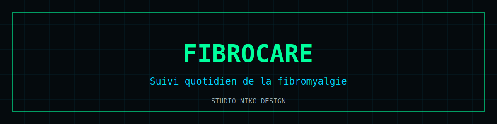

# FibroCare

  

Application de **suivi de la fibromyalgie** : journal des symptômes, douleurs, sommeil et énergie, pour objectiver son vécu et préparer ses consultations.

**Démo** : [nikoju1977.github.io/fibrocare](https://nikoju1977.github.io/fibrocare/)

## Fonctionnalités

- 📓 Journal quotidien : douleur, fatigue, sommeil, humeur
- 📊 Visualisation des tendances dans le temps
- 🩺 Synthèses utiles à partager avec son médecin
- 🔐 100 % local : aucune donnée de santé ne quitte l'appareil

## Stack

`HTML/CSS/JS single-file` · `safeStorage (IndexedDB)` · `Canvas charts` · `PWA`

## Lancer en local

Ouvrir `index.html`. Les données restent sur votre appareil.

## ⚠️ Avertissement médical

Cette application est un **outil d'information et de suivi personnel**. Elle ne constitue pas un dispositif médical certifié, ne fournit ni diagnostic ni prescription, et ne remplace en aucun cas l'avis d'un professionnel de santé. En cas d'urgence : **15 (SAMU)** ou **112**.

## Licence

[MIT](LICENSE) © 2026 Nicolas Julienne — Studio Niko Design
